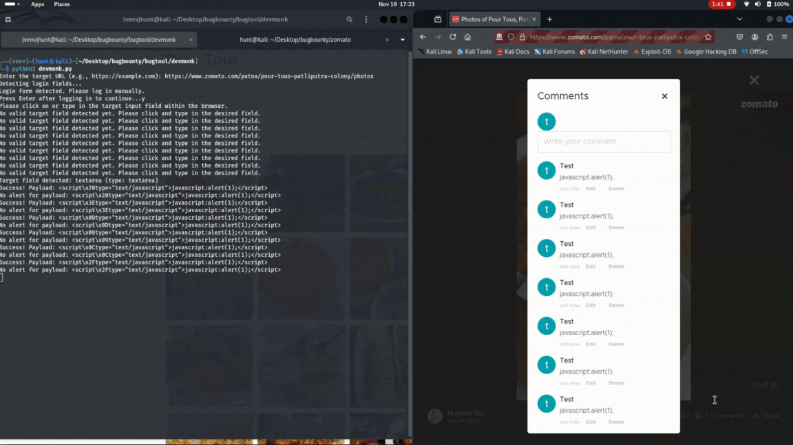

# DevMonk 💀

DevMonk is an automated penetration testing tool designed to test websites for XSS (Cross-Site Scripting) vulnerabilities. It allows security researchers to inject payloads into input fields and test their effectiveness, saving time and effort in manual testing.

## Demo 🎥


---

## Features 🚀
- Automates XSS payload injection into web application input fields.
- Supports detection of successful XSS payloads with browser alerts.
- Logs successful payloads into a file for future reference.
- Handles login detection for secured websites before testing.
- Prompts user to proceed only when a successful payload is detected.

---

## Prerequisites ⚙️
- **Python 3.x** installed.
- Selenium library installed (`pip install selenium`).
- Firefox browser with [Geckodriver](https://github.com/mozilla/geckodriver/releases) configured in PATH.
- A text file containing XSS payloads (e.g., `xss_payloads.txt`).

---

## Installation 📦
1. Clone the repository:
   ```bash
   git clone https://github.com/Amrendra1111/devmonk.git
   cd devmonk
## Usage 🛠️

    Run the script:

- python3 devmonk.py
- Enter the target URL when prompted:
- Enter the target URL (e.g., https://example.com):
- Log in to the website if required. The script will wait for manual login.
- Click on the desired input field, and the tool will:
- Start injecting XSS payloads.
- Detect alerts and log successful payloads.
- Prompt you to proceed after each payload execution.

## Example ✨

- Enter the target URL (e.g., https://example.com): https://vulnerable-site.com
- Detecting login fields...
- Login form detected. Please log in manually.
- Press Enter after logging in to continue...
- Please click on or type in the target input field within the browser.
- Success! Payload: <script>alert('XSS');</script>
- Proceed with next payload? (y/n): y
- No alert for payload: ""
- Proceed with next payload? (y/n): n

## Disclaimer ⚠️

This tool is for educational and ethical penetration testing purposes only.
Use it only on websites you own or have explicit permission to test. Unauthorized usage may violate laws and result in legal consequences.
